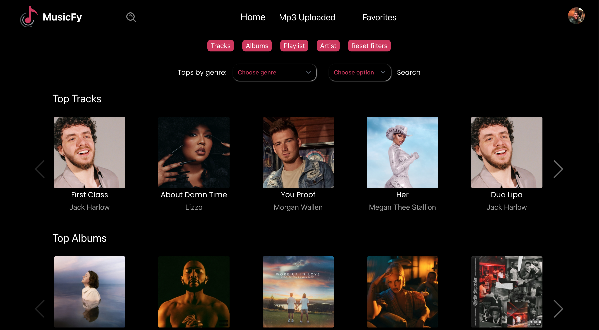
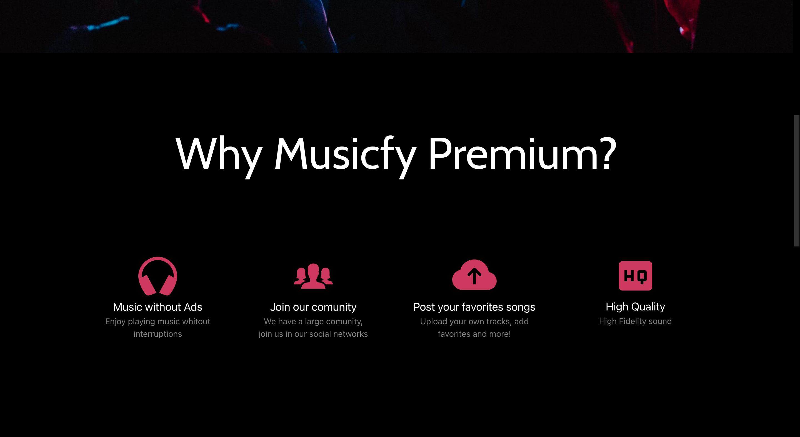
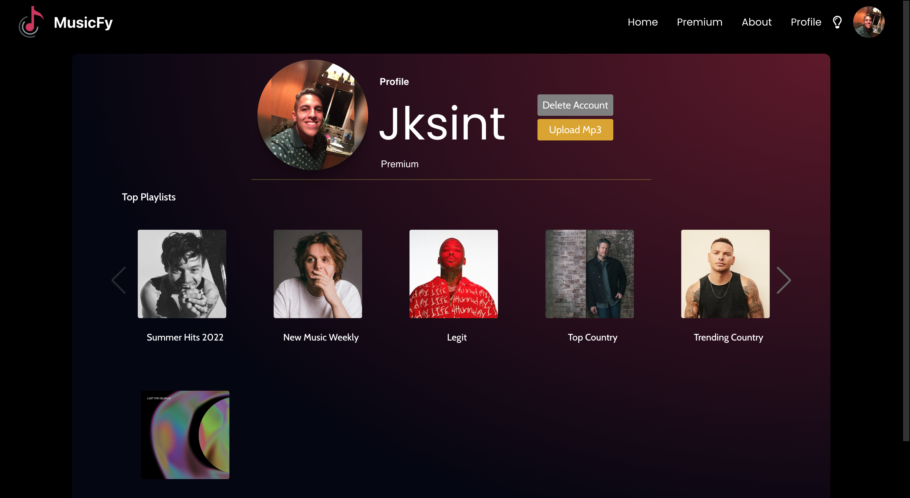
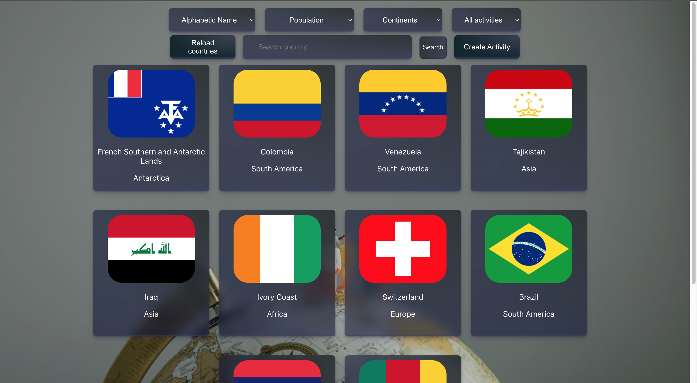
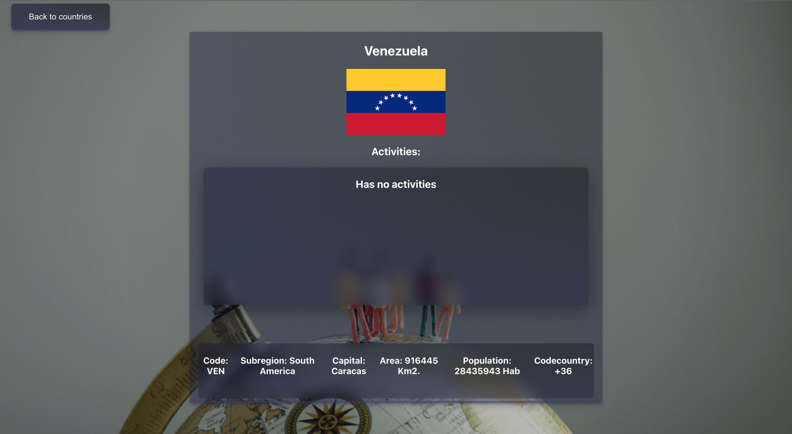

<h3 title="hehehe"> Hey 👋, bienvenid@!</h3>

  
</a>
 
 

 
 

Hola! , soy **Jose Casanova**, **Frontend Developer** 🚀 de O carballiño, Ourense.

  

**Acerca de mi!**

- 📗 Me encuentro aprendiendo React - React Native
- 🌱 Explorando diariamente acerca del Frontend y Backend.
- 📫 Enviame un mensaje a:  [jacapersonal04@gmail.com](mailto:jacapersonal04@gmail.com).
- 📝 Puedes ver mi [Curriculum Vitae](https://drive.google.com/file/d/1dqLB8OCX55Q72oSKJKBF95UEuFUkIyh-/view?usp=sharing) Para obtener mas información.

 
 
 
 
 

## Proyectos
* Musicfy. Es una App web de streaming de música, que permite como usuario escuchar on Demand, tiene sistema de autenticación y una pasarela de pagos con Mercado Pago integrada. Mi trabajo en la app estuvo enfocado en como se apreciaba el home de las canciones y el perfil donde se mostraba información del usuario y playlist creadas, creando una vista de fácil acceso y manejo para el usuario.

* Link a Musicfy https://app-musicfy.vercel.app/

 

* CountriesApp! Single Page Application realizada como proyecto individual, cuenta con barra de busqueda, filtrados, detalle de cada país y paginación. Tecnologías utilizadas:
JavaScript.  Back-End: NodeJs, ExpressJs, Sequelize. Front-End: React, Redux, CSS Puro. Deploy: Heroku y Vercel. Data Base: PostgreSQL. Control de versiones: Git/GitHub.

* Link a Countries App https://pi-countriesjc.vercel.app/countries

 

 

**Languages and Tools:**  

          
 
               
 
 
          
 
 

 
 

## ¿Quieres saber más de mi? ¡Contáctame! 

* ✉️ Email: jacapersonal04@gmail.com
* 👤 Portfolio: https://josecasanova.vercel.app/
* 💬 LinkedIn: https://www.linkedin.com/in/jacasanova98/

